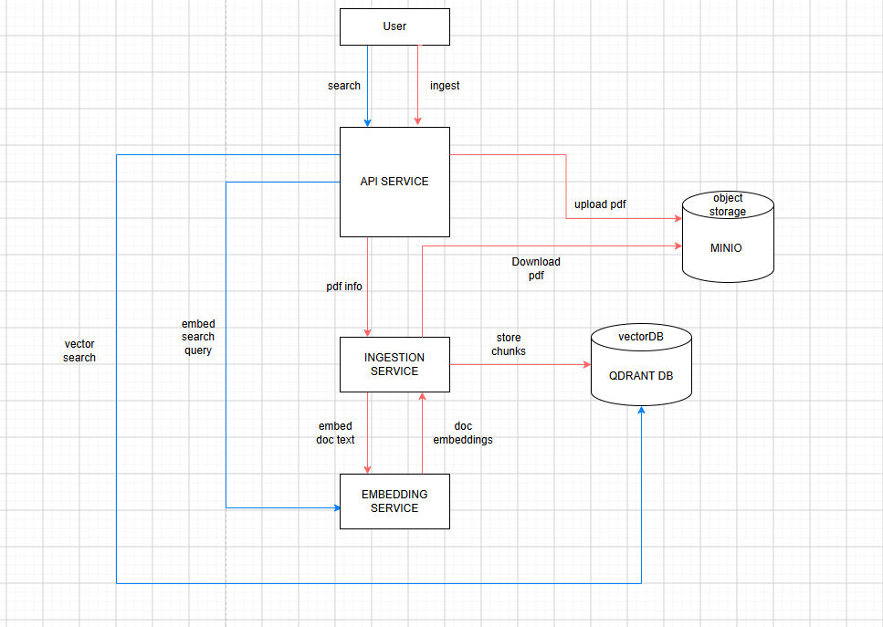

# PDF Ingestion and Semantic Search

This project ingests PDF documents, splits their content into semantic chunks, stores vector embeddings, and provides similarity-based search through a public API.

## Services

### API Service

The public entry point for the system. It accepts PDF uploads, stores the original files in MinIO, coordinates document ingestion, and handles semantic search requests.

**Port:** `8000`

### Ingestion Service

Downloads PDFs from MinIO, extracts and cleans their text, creates semantic chunks, requests embeddings, and saves the resulting vectors and metadata in Qdrant.

**Internal port:** `8001`

### Embedding Service

Loads the `BAAI/bge-small-en-v1.5` model once and converts document chunks and search queries into 384-dimensional vectors. It uses an NVIDIA GPU by default.

**Internal port:** `8002`

### Qdrant

Stores the chunk embeddings and document metadata, then performs cosine-similarity searches against them.

The inserted data can be viewed in the [Qdrant dashboard](http://localhost:6333/dashboard#/).

### MinIO

Provides S3-compatible object storage for the original uploaded PDF files.

The stored documents can be viewed at [http://localhost:9001](http://localhost:9001).

**Username:** `minioadmin`  
**Password:** `minioadmin`

## Architecture Diagram



## Run the Project

### Requirements

- Docker with Docker Compose v2
- An NVIDIA GPU, compatible driver, and NVIDIA Container Toolkit

### Start

Start the complete project with the orchestration script:

```bash
./orchestrate.sh --action start
```

Once startup is complete, the API is available at [http://localhost:8000](http://localhost:8000).

### Stop

Stop the project and remove its volumes with:

```bash
./orchestrate.sh --action terminate
```

> **Note:** The initial Docker image download took approximately 30 minutes. Later starts should be faster because Docker reuses cached images and layers.
